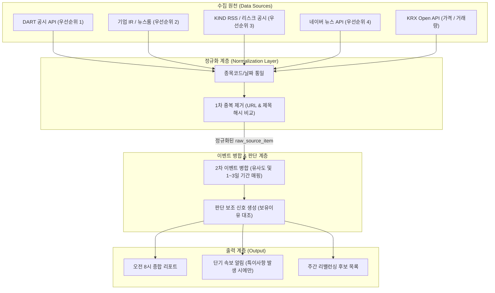
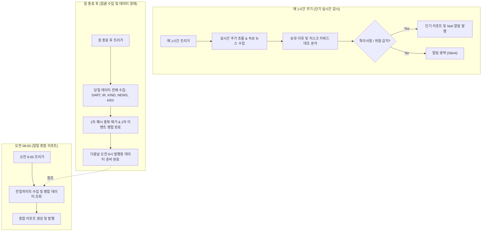
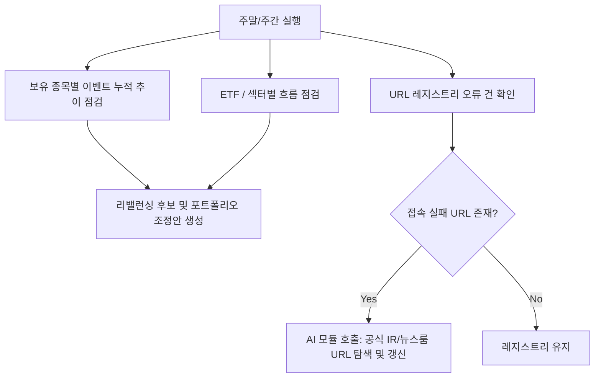

# Stock-Noti 프로젝트 기본 워크플로우

이 시스템의 핵심 동작 흐름을 시각화한 다이어그램입니다. 지정된 스케줄러(오전 8시 종합 리포트 및 매시간 단기 감시 루프)에 따라 작동합니다.

---

## 1. 전체 데이터 파이프라인 흐름

---

## 2. 시간별 스케줄 및 운영 흐름 (Scheduling Flow)

---

## 3. 주간 운영 흐름 (Weekly Operations Flow)

